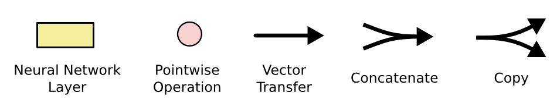
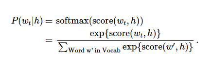

#readme
```python
from __future__ import absolute_import
from __future__ import division
from __future__ import print_function

import time
import sys

import os
os.environ['TF_CPP_MIN_LOG_LEVEL']="2"
#适配cpu

import pdb
import tensorflow.python.platform

import numpy as np
import tensorflow as tf
#导入tensorflow

import ptb_reader
import ptb_server
#ptb_reader是用来读取数据的
#ptb_server是用来启动服务器的，这里其实没有用到
```
#####上述是需要带入的库
```python
def data_type():
    return tf.float16 if FLAGS.use_fp16 else tf.float32
    ##定义数据的类型
```
#####定义数据的格式
```python
flags = tf.flags
logging = tf.logging

flags.DEFINE_string(
    "model","small",
    "A type of model.Possible options are:small, medium, large.")
flags.DEFINE_string("data_path",None,"data_path")
flags.DEFINE_string("interactive",None,"interavtive")
flags.DEFINE_bool("use_fp16",False,"Train using 16-bit floats instead of 32bit floats")

FLAGS = flags.FLAGS
```
#####定义模型的大小，可以从terminal输入
#####eg:python xxx.py --model=small
#####定义数据的路径，可以从terminal输入
#####eg:python xxx.py --data_path=...
#####定义交互模式(interactive)
#####eg:python xxx.py --interactive="shell"
```python
#model的创建
class PTBModel(object):
    def __init__(self,is_training,config,is_query=False,is_generative=False):
        self.batch_size = batch_size = config.batch_size
        self.num_steps = num_steps = config.num_steps
        size = config.hidden_size
        vocab_size = config.vocab_size
        #one input word is projected into hidden_size space using embeddings
        self._input_data = tf.placeholder(tf.int32,[batch_size,num_steps])
        self._prior_output =tf.placeholder(tf.int32,[batch_size,size])
        self._targets = tf.placeholder(tf.int32,[batch_size,num_steps])

        #Slightly better results can be obtained with forget gate biases
        #initialized to 1 but the hyperparameters of the model would need to be
        #different than reported in the paper

        lstm_cell = tf.contrib.rnn.BasicLSTMCell(size,forget_bias =0.0,state_is_tuple=False)
        if is_training and config.keep_prob < 1:
            lstm_cell = tf.contrib.rnn.DropoutWrapper(
                lstm_cell,output_keep_prob=config.keep_prob)
        cell = tf.contrib.rnn.MultiRNNCell([lstm_cell]*config.num_layers,state_is_tuple=False)

        self._initial_state = cell.zero_state(batch_size,tf.float32)
        print("model:_initial_state:")
        print(self._initial_state)

        #if not is_generative:
        with tf.device("/cpu:0"):
            embedding = tf.get_variable(
                "embedding", [vocab_size, size], dtype=data_type())
            inputs = tf.nn.embedding_lookup(embedding, self._input_data)


        if is_training and not is_query and is_generative and config.keep_prob < 1:
            inputs = tf.nn.dropout(inputs,config.keep_prob)

        outputs =[]
        print("embedding")
        print(embedding)
        states = []
        state = self._initial_state
        with tf.variable_scope("RNN"):
            for time_step in range(num_steps):
                if time_step > 0: tf.get_variable_scope().reuse_variables()
                (cell_output,state) = cell(inputs[:,time_step,:],state)
                outputs.append(cell_output)
                states.append(state)    
        #output dimension is batch_sizeXhidden_size
        outputs = tf.concat(outputs,1)
        output = tf.reshape(outputs,[-1,size])
        #output tf.reshape(tf.concat(1,outputs),[-1,size])
        #logit dimension is batch_sizeX
        logits =tf.nn.xw_plus_b(
                            output,
                            tf.get_variable("softmax_w",[size,vocab_size]),
                            tf.get_variable("softmax_b",[vocab_size]))
        self._logits = logits
        self._outputs = outputs
        self._output = output
        self._inputs = inputs
        self._final_state = states[-1]
        logits = tf.reshape(logits,[self.batch_size,self.num_steps,vocab_size])
        #tf.reshape(self._targets,[-1]),
        transfer_target = tf.reshape(self._targets,[self.batch_size,self.num_steps])
        #self._targets = tf.reshape(self._targets,[self.batch_size,self.num_steps])
        weights = tf.ones([self.batch_size,self.num_steps],dtype = data_type())
        if is_query or is_generative:
            #slef._loigts = tf.matmul(output,tf.get_variable("softmax_w"))+tf.get_variable("softmax_b")
            probs = tf.nn.softmax(logits)
            self._probs = probs
            top_k = tf.nn.top_k(probs,20)[1]
            self._top_k = top_k
            return
        else:
            loss = tf.contrib.seq2seq.sequence_loss(logits,
                                                transfer_target,
                                                weights)
            self._cost = cost = tf.reduce_sum(loss)/batch_size
            if not is_training:
                return
        self._lr = tf.Variable(0.0,trainable = False)
        tvars = tf.trainable_variables()
        grads,_ = tf.clip_by_global_norm(tf.gradients(cost,tvars),
            config.max_grad_norm)
        optimizer = tf.train.GradientDescentOptimizer(self.lr)
        self._train_op = optimizer.apply_gradients(zip(grads,tvars))

    def assign_lr(self,session,lr_value):
        session.run(tf.assign(self.lr,lr_value))
    @property
    def input_data(self):
        return self._input_data


    @property
    def targets(self):
        return self._targets

    @property
    def initial_state(self):
        return self._initial_state

    @property
    def output(self):
        return self._output

    @property
    def outputs(self):
        return self._outputs


    @property
    def prior_output(self):
        return self._prior_output

    @property
    def inputs(self):
        return self._inputs


    @property
    def logits(self):
        return self._logits


    @property
    def cost(self):
        return self._cost


    @property
    def top_k(self):
        return self._top_k


    @property
    def probs(self):
        return self._probs

    @property
    def final_state(self):
        return self._final_state

    @property
    def lr(self):
        return self._lr

    @property
    def train_op(self):
        return self._train_op
```
#####开始分析模型的创建
```python
        self.batch_size = batch_size = config.batch_size
        self.num_steps = num_steps = config.num_steps
        size = config.hidden_size
        vocab_size = config.vocab_size
        #one input word is projected into hidden_size space using embeddings

        self._input_data = tf.placeholder(tf.int32,[batch_size,num_steps])
        self._prior_output =tf.placeholder(tf.int32,[batch_size,size])
        self._targets = tf.placeholder(tf.int32,[batch_size,num_steps])
```
#####self.batch_size = batch_size = config.batch_size
#####这里可以看到model的batch_size是赋值成了config的batch_size
#####那么这里就需要提到config
#####那么先来看一下代码的config部分
#####由于config的定义都是差不多的，因此我只取small为例子
```python
class SmallConfig(object):
    """Small config."""
    init_scale = 0.1
    learning_rate = 1.0
    max_grad_norm = 5
    num_layers = 2
    num_steps = 20
    hidden_size = 200
    max_epoch = 4
    max_max_epoch = 1#13
    keep_prob = 1.0
    lr_decay = 0.5
    batch_size = 40
    vocab_size = 10000
  #rnn_mode = BLOCK
```
#####这里可以看到参数有很多
#####我来一一解释
#####init_scale 初始化时候的一个参数，具体的语句是main函数中的这句
```python
initializer = tf.random_uniform_initializer(-config.init_scale,config.init_scale)
```
#####learning_rate = 1.0
#####learning_rate是机器学习的速率
#####max_grad_norm = 5
#####是规定梯度(grad)范数(norm)的一个参数，涉及凸优化的知识，这里我也不展开
#####具体可以查看一下《凸优化》这本书，是用来控制梯度膨胀，如果梯度向量的L2超过max_grad_norm，则等比例缩小
#####num_layers = 2 LSTM神经网络的层数,我会在下面介绍LSTM神经网络，LSTM神经网络通常是分析NLP时序问题的一个很有利的神经网络
#####num_steps = 20 数据（一句句子的单词个数）
#####hidden_size = 200 ，在模型中赋值给了size,size用来初始化一层的LSTM的cell个数
#####max_epoch = 4,最大时段数，这个epoch是一个时段的意思,和batch_size,num_stpes有关，这边定义max_epoch的意思是当epoch＜max_epoch时候，lr_decay=1,当epoch>max_epoch时，lr_decay开始减小
#####max_max_epoch=13,是指整个文本的循环次数
#####keep_prob = 1.0 是用于定于dropout.dropout是一个在神经网络中运用的非常广的技术，具体简明的含义是：在每批数据输入的时候，神经网络中的每个cell会以1-keep_prob的概率不工作，主要的作用是防止过拟合
#####lr_decay = 0.5 学习速率衰减率
#####batch_size = 40 每批数据的规模，每批数据的数量为40，在此处是40句句子
#####vocab_size = 10000 词典的规模，需要在词典中查阅一个词的频率或者id号
#####那么此时在回看上面的model中的代码
```python
        self.batch_size = batch_size = config.batch_size
        self.num_steps = num_steps = config.num_steps
        size = config.hidden_size
        vocab_size = config.vocab_size
        #one input word is projected into hidden_size space using embeddings

        self._input_data = tf.placeholder(tf.int32,[batch_size,num_steps])
        self._prior_output =tf.placeholder(tf.int32,[batch_size,size])
        self._targets = tf.placeholder(tf.int32,[batch_size,num_steps])
```
#####这里的意思也很明显了
#####然后是input_data,这里的tf.placeholder是一个占位符，是tensorflow中特有的一个功能，具体我们可以在训练或者预测的时候在丢数据进去，这边它占据了batch_szie * num_steps 大小的空间，意思就是，每个batch的batch_size为 batch_size,也就是句子数量，一句句子所含的单词个数是 num_steps个
#####prior_output是前一次的输出，大小是batch_size,size大小
#####但是其实这边暂时用不到
#####target就是训练样本的label，也是batch_size句句子
#####具体的target就是将原来的input_data中的单词取后一个单词，然后组成的句子
#####eg:
#####input:[9970,9971,9972,9974,9975]
#####target:[9971,9972,9974,9975,997x]
#####这就是一句句子的target
#####这里的9970的数字是word在词典中的id，所以这句句子是9970，9971...对应的word组成的句子，但是用id表示可以量化，但是这不是最好的量化，更好的量化方法我会在下面介绍
```python
lstm_cell = tf.contrib.rnn.BasicLSTMCell(size,forget_bias =0.0,state_is_tuple=False)
        if is_training and config.keep_prob < 1:
            lstm_cell = tf.contrib.rnn.DropoutWrapper(
                lstm_cell,output_keep_prob=config.keep_prob)
        cell = tf.contrib.rnn.MultiRNNCell([lstm_cell]*config.num_layers,state_is_tuple=False)

        self._initial_state = cell.zero_state(batch_size,tf.float32)
```
#####BasicLSTMCell是用来初始化单层的LSTM的,size就是之前提到的hidden_size = 200
#####forget_bias是LSTM中一个很重要的参数
#####这里来介绍一下LSTM
#####首先来介绍一下RNN - Recurrent Neural Networks
#####人类并不是每时每刻都从一片空白的大脑开始他们的思考。在你阅读这篇文章时候，你都是基于自己已经拥有的对先前所见词的理解来推断当前词的真实含义。我们不会将所有的东西都全部丢弃，然后用空白的大脑进行思考。我们的思想拥有持久性。
#####传统的神经网络并不能做到这点，看起来也像是一种巨大的弊端。例如，假设你希望对电影中的每个时间点的时间类型进行分类。传统的神经网络应该很难来处理这个问题——使用电影中先前的事件推断后续的事件。
#####RNN 解决了这个问题 -以上是我摘自简书
#####
#####上面是简化的模式，具体的动态模式如下：
#####
#####在上面的示例图中，神经网络的模块，A，正在读取某个输入 x_i，并输出一个值 h_i,循环可以使得信息可以从当前步传递到下一步。就是说，rnn可以利用之前之前的信息进行对下一个信息的预测，the sky is blue, 训练好的模型读取了the sky is 自然而然可以预测出blue，同时，当句子是the environment is polluted seriously, the sky is 模型就可以预测出grey
#####但是rnn存在一个问题，当时序数据非常大的时候，在进行凸优化的时候会产生梯度爆炸（gradient exploding problem）或者是梯度消散(gradient vanishing priblem)
#####因此,LSTM就诞生了
#####
#####这里可以看到，h_t+1这个输出，无法获得x_0和x_1的信息，因为相距实在太远了，那么这个时候LSTM就可以发挥出相应的作用了
#####Long Short Term 网络—— 一般就叫做 LSTM ——是一种 RNN 特殊的类型，可以学习长期依赖信息。LSTM 由Hochreiter & Schmidhuber (1997)提出，并在近期被Alex Graves进行了改良和推广。在很多问题，LSTM 都取得相当巨大的成功，并得到了广泛的使用。
#####LSTM 通过刻意的设计来避免长期依赖问题。记住长期的信息在实践中是 LSTM 的默认行为。
#####所有 RNN 都具有一种重复神经网络模块的链式的形式。在标准的 RNN 中，这个重复的模块只有一个非常简单的结构，例如一个 tanh 层。
#####标准的RNN中重复模包含单一的层
#####
#####LSTM同样是这样的结构，但是重复的模块拥有一个不同的结构，不同于单一神经网络层，这里是四个，以一种非常特殊的方式进行交互
#####
#####LSTM需要每个时刻的状态(state)和输出(output),但是其实在tensorflow中定义state的时候是同时定义在state中的，但是也会输出单独的outut
```python
with tf.variable_scope("RNN"):
            for time_step in range(num_steps):
                if time_step > 0: tf.get_variable_scope().reuse_variables()
                (cell_output,state) = cell(inputs[:,time_step,:],state)
                outputs.append(cell_output)
                states.append(state)    
        #output dimension is batch_sizeXhidden_size
```
#####cell_output,state就是对应的每个时刻的输出和状态(其实tensorflow中的state包含了output，也就是说state = (c,h)这里的，c是每个时刻的输出的状态，h是每个时刻输出的结果，都是需要用于下一个时刻的)
#####因此cell()的参数只包含了Input(对应的x_i,这里就是一个单词对应的embedding),和state
#####LSTM结构图中的符号
#####
#####其实lstm具体内层结构不需要具体阐明，因为tensorflow强大的功能，已经封装好了，我们只需要大概了解，这边我就的具体介绍了
#####总的来说，forget_bias的意思就是到遗忘门的偏置,为了减少在开始训练时遗忘的规模。
#####看到这里应该明白了，LSTM之所以可以处理这么庞大的数据，就是因为它会进行遗忘和记忆，经过训练进行遗忘和记忆，是LSTM可以处理大型seq的关键，上面的复杂层的处理，就是为了遗忘和记忆准备的。
#####那么，LSTM的原理已经介绍的差不多了
```python
if is_training and config.keep_prob < 1:
            lstm_cell = tf.contrib.rnn.DropoutWrapper(
                lstm_cell,output_keep_prob=config.keep_prob)
```
#####这里用到了keep_prob
#####dropoutWrapper
#####上述的代码是在LSTM外面包一层dropout
#####dropout:网络中每个单元在每次有数据输入时有一定的概率(keep_prob)正常工作，否则就输出0。经过查阅资料，这是一种比较有效的正则化的方法，可以有效防止过拟合，具体原理可以去查看相关的文献
```python
        cell = tf.contrib.rnn.MultiRNNCell([lstm_cell]*config.num_layers,state_is_tuple=False)

        self._initial_state = cell.zero_state(batch_size,tf.float32)
```
#####这里就是字面意思，进行多层LSTM结构和状态的初始化
#####cell.zero_state就是将初始的state都设置为0
#####那么这里问题来了，输入到底是什么？这是在当时长期困扰我的问题，上述的参数问题我也进行了很多的查阅和尝试，最终都基本解决了，输入是什么？是句子还是单词？都不是！
#####LSTM的输入和其他的机器学习模型非常不同，因为这是一个时序问题，不是简单的而机器学习识别图片和预测房价问题（我之前做过预测房价的模型）
#####输入的是句子，但是句子按照单词分成num_steps个时刻，也就是num_steps个word,每个时刻输入的还不是单词，而是单词对应的embedding!
#####tensorflow的功能非常强大，但是官方文档非常模糊，这块着重介绍了word2vec和embedding,通俗的来说，embedding就是word2vec,这里是我思考最多的地方。
```python
with tf.device("/cpu:0"):
            embedding = tf.get_variable(
                "embedding", [vocab_size, size], dtype=data_type())
            inputs = tf.nn.embedding_lookup(embedding, self._input_data)
```
#####这段代码是这个模型的关键
#####这里介绍一下embedding
#####在介绍embedding之前我先来说一下one-hot
#####one-hot直接翻译就是“独热”
#####是最原始的表示字，词的方式，eg:
#####i love you -> i :[1,0,0] love:[0,1,0] you:[0,0,1]那么可以看到，如果数据量很大的话，最后的表示字，词的向量会非常稀疏，也可能会导致过拟合
#####one-hot的好处：相对于不相关的词语，比如：policeman,journalist等，这样的表示可以让词之间的距离相等，但是对于互相有关系的词，如mom,dad,这样的表示就无法体现出二者的意义，而embedding的出现解决了这个问题，上述的代码使用了embedding,定义了每个word的embedding为1 * size维度的vector,将新建了一个embedding词典，但是原本的频数词典也需要用到

#####tf.nn.embedding_lookup就是在embedding中查找input的word的embedding,最后的inputs是 batch_size * hidde_size * embedding(size)
#####那么我们再来看一下embedding,假设一共有m个物体，每个物体有自己唯一的id，那么从物体的集合到\mathbb R^m有一个trivial的嵌入，就是把它映射到\mathbb R^m中的标准基，这种嵌入叫做One-hot embedding/encoding.
#####应用中一般将物体嵌入到一个低维空间\mathbb R^n(n \ll m) ，只需要再compose上一个从\mathbb R^m到\mathbb R^n的线性映射就好了。每一个n\times m 的矩阵M都定义了\mathbb R^m到\mathbb R^n的一个线性映射: x \mapsto Mx。当x 是一个标准基向量的时候，Mx对应矩阵M中的一列，这就是对应id的向量表示。
#####
#####那么要怎么生成这些embedding呢，tensorflow的代码是没有明确说明，为此我去查了embedding的官方文文档

#####官方文档原文:
#####输入
#####在输入 LSTM 前，词语 ID 被嵌入到了一个密集的表示中(查看 矢量表示教程)。这种方式允许模型高效地表示词语，也便于写代码：

##### embedding_matrix 张量的形状是： [vocabulary_size, embedding_size]
#####word_embeddings = tf.nn.embedding_lookup(embedding_matrix, word_ids)
#####嵌入的矩阵会被随机地初始化，模型会学会通过数据分辨不同词语的意思。
#####非常模糊。
#####继续查看详细的文档
#####tensorflow官方文档解释了处理噪声对比训练：神经概率化语言模型通常使用极大似然法(ml)来进行训练，然后通过soft_max函数来最大化当提供前一个词h，后一个词wt(target)的概率
#####
#####score计算了文字w_t和上文h的兼容性，然后对似然函数进行训练，比如上述的公式，但是我最后发现，其实它这个tensorflow说的理论知识和自己代码写的不是一个东西...
#####然后终于找了很久找到了一篇相关的文章
以下是网上查阅整理的资料文献
语言模型是一种概率模型，它是基于一个语料库创建，得到每个句子出现的概率，通俗一点讲就是看一句话是不是正常人说出来的，数学上表示为:

P(W)=P(w1w2…wt)=P(w1)P(w2|w1)P(w3|w1w2)⋯P(wt|w1w2⋯wt−1)(2-1)
上述公式的意义是：一个句子出现的概率等于给定前面的词情况下，紧接着后面的词出现的概率。它是通过条件概率公式展开得到。其中条件概率 P(w2|w1),P(w3|w1w2),⋯,P(wt|w1w2⋯wt−1) 就是创建语言模型所需要的参数，每个条件概率的意义解释为:根据前面的词预测下一个词的概率。有了这些条件概率参数，给定一个句子，就可以通过以上公式得到一个句子出现的概率。例如有一句话“php是最好的语言”（我不确定这是不是自然语言），假设已经分词为“php”、“是”、“最好的”、“语言”，那么它出现的概率为P(“php”，“是”，“最好的”，“语言”)=P(“php”)P(“是”|“php”)P(“最好的”|“php”，“是”)P(“语言”|“php”，“是”，“最好的”)，如果这个概率较大，那么判断为正常的一句话。以上这些条件概率通过如下贝叶斯公式得到：


根据大数定理上述公式又可以近似为：


假如语料库里有 N 个词，一个句子长度为 T ，那么就有 NT 种可能，每一种可能都要计算 T 个条件概率参数，最后要计算 TN^T 个参数并保存，不仅计算量大，对于内存要求也是惊人。那么如何避免这个问题呢，之前穷举的方法行不通，那么换个思路，采用一种偷懒的处理方法，就是将上述公式中条件概率做个如下近似：
P(wt|w1w2⋯wt−1)≈P(wt|wt−n+1⋯wt−1)
这意思就是说一个词出现的概率只与它前面 n−1 个词有关，而不是与它前面所有的词有关，这样极大的减少了统计的可能性，提高了计算效率，这种处理方法称之为 n-gram 模型，通常 n 取2~3就能得到不错的效果。总结起来，n-gram 模型就是统计语料库中词串出现的次数，一次性计算得到词串的概率并将其保存起来，在预测一个句子时，直接通过前面所述的条件概率公式得到句子出现的概率。

近年也流行起神经网络语言模型，从机器学习的角度来看，一开始不全部计算这些词串的概率值，而是通过一个模型对词串的概率进行建模，然后构造一个目标函数，不断优化这个目标，得到一组优化的参数，当需要哪个词串概率时，利用这组优化的参数直接计算得到对应的词串概率。将词串概率 P(w|context(w)) 看做是 w 和 context(w) 的函数，其中 context(w) 表示此 w 的上下文，即相当于前面所述的 n-gram 模型的前 n−1 个词，那么就有如下数学表示。

P(w|context(w))=F(w,context(w),Θ)
目标函数采用对数似然函数，表示如下(其中 N 代表语料库中词典的大小)：

Obj=1/N∑i=1/NlogP(wi|contexti)

通过优化算法不断最小化目标函数得到一组优化的参数 Θ ，在神经网络中参数 Θ 则为网络层与层间的权值与偏置。那么在用神经网络学习语言模型[1]时，如何表示一个词呢？通常，在机器学习领域，是将一个样本对象抽象为一个向量，所以类似地，神经网络语言模型中是将词(或短语)表示为向量，通常叫做word2vec。那么神经网络语言模型就可以表示如下示意图。


上述神经网络包括输入层、投影层、隐藏层以及输出层，其中投影层只是对输入层做了一个预处理，将输入的所有词进行一个连接操作，假如一个词表示为 m 维向量，那么由 n−1 个词连接后则为 (n−1)m 维向量，将连接后的向量作为神经网络的输入，经过隐藏层再到输出层，其中 W 、U 分别为投影层到隐藏层、隐藏层到输出层的权值参数，p 、q 分别为投影层到隐藏层、隐藏层到输出层的偏置参数，整个过程数学表达如下：

Z=σ(WX+p)
Y=UZ+q
(其实上图的U是W，U是V)

其中 σ 为sigmoid函数，作为隐藏层的激活函数，输出层的输出向量为 N 维，对应于语料库中词典的大小。一般需要再经过softmax归一化为概率形式，得到预测语料库中每个词的概率。以上神经网络语言模型看似很简单，但是词向量怎么来呢，如何将一个词转化为向量的形式呢？下面作详细阐述。
```pyton
if is_query or is_generative:
            #slef._loigts = tf.matmul(output,tf.get_variable("softmax_w"))+tf.get_variable("softmax_b")
            probs = tf.nn.softmax(logits)
            self._probs = probs
            top_k = tf.nn.top_k(probs,20)[1]
            self._top_k = top_k
            return
        else:
            loss = tf.contrib.seq2seq.sequence_loss(logits,
                                                transfer_target,
                                                weights)
            self._cost = cost = tf.reduce_sum(loss)/batch_size
            if not is_training:
                return
```
上述的 is_query or is_generative 中的tf.softmax()函数就是进行输出每个词出现在下一个时刻的概率的计算从而进行预测
那么其实这里只是涉及到了模型预测的问题，注意此处所说的参数都是在LSTM内部的参数，那么，embedding从何而来？
###词向量(word2vec)
词向量要做的事就是将语言数学化表示，以往的做法是采用 One-hot Representation 表示一个词，即语料库词典中有 N 个词，那么向量的维度则为 N ，给每个词编号，对于第 i 个词，其向量表示除了第 i 个单元为1，其他单元都为0的 N 维向量，这种词向量的缺点显而易见，一般来说语料库的词典规模都特别大，那么词向量的维数就非常大，并且词与词之间没有关联性，并不能真实地刻画语言本身的性质，例如“腾讯”、“小马哥”这两个词通过One-hot向量表示，没有任何关联。为了克服One-hot Representation 的缺点，Mikolov大神提出了一种 Distributed Representation[2]，说个题外话，在大家都在如火如荼的用CNN做图像识别的时候，这哥们却在研究如何用神经网络处理NLP问题，最后发了大量关于神经网络NLP的高水平论文，成为这一领域的灵魂人物之一。顾名思义，Distributed Representation 就是把词的信息分布到向量不同的分量上，而不是像 One-hot Representation 那样所有信息集中在一个分量上，它的做法是将词映射到 m 维空间，表示为 m 维向量，也称之为 Word Embedding，这样一方面可以减小词向量的维度，另一方面，可以将有关联的词映射为空间中相邻的点，词与词之间的关联性通过空间距离来刻画，如下图所示。


词被映射到3维空间，每个词表示为一个3维向量，相近的词离的较近，可以看到两组差不多关系的词，他们之间的词向量距离也差不多。

要想得到词向量，需要借助语言模型训练得到，本质上来说，词向量是在训练语言模型过程中得到的副产品。解决word2vec问题有两种模型，即 CBOW 和 Skip-Gram 模型[3]，如下图所示：


CBOW 模型是根据词的上下文预测当前词，这里的上下文是由待预测词的前后 c 个词组成。而 Skip-Gram 模型则相反，是通过当前词去预测上下文。给定一个语料库作为训练集，就可以通过以上模型训练出每个词的向量表示。从实验结果来看，CBOW 模型会平滑掉一些分布信息，因为它将词的上下文作为单个样本，而 Skip-Gram 模型将词上下文拆分为多个样本，训练得到的结果更为精确，为此，TensorFlow 中 word2vec 采用的是 Skip-Gram 模型。
###tensorflow 实现
根据以上实现原理，下面结合代码阐述利用TensorFlow实现一个简易的word2vec模型[5]，借助TensorFlow丰富的api以及强大的计算引擎，我们可以非常方便地表达模型。给定语料库作为训练数据，首先扫描语料库建立字典，为每个词编号，同时将那些词频低于min_count的词过滤掉，即不对那些陌生词生成词向量。对于一个样本(“世界上”, “php”)，利用负采样得到若干负实例，分别计算输入词为“世界上”到“php”以及若干负样本的logit值，最后通过交叉熵公式得到目标函数。
logit值就是上述代码的logit
具体的tensorflow实现是使用了
```python
loss = tf.contrib.seq2seq.sequence_loss(logits,
                                        transfer_target,
                                        weights)
self._cost = cost = tf.reduce_sum(loss)/batch_size
```
官方的指南和资料说是使用交叉熵函数(sigmoid_cross_entropy_with_logits)
但是此处使用了sequence_loss
那么来查看一下这个函数，最后发现也是计算交叉熵的,all right。那么结束
训练模型的部分就到这里结束了！
如何预测？非常简单，将想要预测的位置的前文输入进模型，同时赋一个全0的初始state,最后输出结果再套用一个softmax函数，就可以得到每个单词在这个位置的出现概率了。

综上所述，LSTM内部参数，embedding都是需要训练的参数。这个和一般的机器学习问题就不太一样了。
